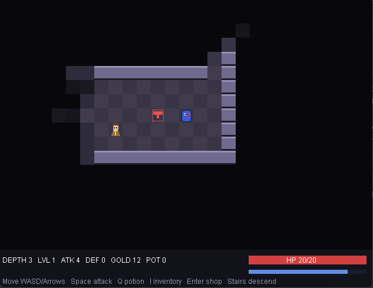

# Duke's Descent

A procedural dungeon crawler starring Duke, the Java mascot, built for the 8-bit
challenge. Descend through randomly generated floors, fight Java-themed enemies, 
level up, and see how deep you can get before you fall.



## Build & Run

Requires **JDK 25**.

```
./gradlew run     # play
./gradlew size    # print the measured runtime size
./gradlew build   # compile + package
```

## Controls

| Action | Key |
| --- | --- |
| Move | WASD / Arrow keys |
| Attack | Space |
| Drink potion (heal) | Q |
| Talk to merchant / open shop | Enter |
| Buy potion (in shop) | B |
| Descend / ascend | Walk onto the gold / red stairs |
| Pause (Resume / Quit) | Esc |

## Gameplay

- **Goal:** descend as far as possible. Score is the deepest floor reached.
- **Fog of war:** only tiles in line of sight are visible; explored tiles stay dimly remembered.
- **Enemies** (Bug, NullPointer, MemoryLeak) wake only once they enter your light, then pursue in real time. Their numbers and stats scale gently with depth.
- **Progression:** kills grant XP and gold; leveling raises max HP and attack. HP also regenerates slowly while exploring.
- **Merchant:** a shopkeeper spawns on each floor and sells potions for gold.
- **Audio:** procedural sound effects (slash, hit, footstep, stairs) and a looping chiptune track, all synthesized at runtime.

## Architecture

Four classes, each with a single responsibility:

| Class | Responsibility |
| --- | --- |
| `Main` | Window, render loop, and keyboard input. |
| `Game` | All simulation: map generation, field of view, entities, combat, progression, and state. |
| `Renderer` | All drawing; stateless and derived entirely from `Game`. |
| `Sound` | Procedural MIDI: sound effects and a looping music track via the JDK synthesizer. |

Key decisions:

- **Data-oriented state.** The world is flat primitive arrays (`int[] map`, parallel enemy arrays) rather than an object hierarchy — no per-entity classes or allocations.
- **Real-time over discrete logic.** Player, enemy, and attack actions run on independent millisecond clocks and are interpolated each frame.
- **Fully procedural content.** Floors use rectangular rooms joined by corridors; visibility uses per-tile ray casting; sprites are composed of primitive shapes.
- **Procedural audio.** Effects are short synthesized blips; the music is a sequencer loop routed into the same JDK synthesizer on its own channels. Nothing is loaded from disk, so the resources directory stays empty.
- **Deterministic floors.** Layout, enemies, and the merchant are produced from a per-floor seed (`baseSeed + floor`), so revisited floors regenerate identically.

## Code design notes

A few implementation choices and the reasoning behind them:

- **Input as flags drained by the loop.** Key events (AWT's event thread) only set held/request booleans; the game loop reads and acts on them. Simulation stays on a single thread, and discrete actions (potion, buy, pause, stairs) use edge detection so a held key fires once instead of repeating with the OS key-repeat.
- **Single integer game state.** `PLAYING` / `SHOP` / `PAUSED` / `DEAD` is one `int` switched on in update and render; a minimal state machine that needs no extra classes or enums.
- **Swap-remove entity arrays.** A dead enemy is removed by copying the last active entry over its slot and shrinking the count. Removal is O(1), order is irrelevant, and no objects are allocated or garbage-collected mid-run.
- **Ray-cast field of view.** Visibility casts a straight line to each tile within radius and stops at the first wall. Chosen for compactness over heavier shadow-casting; it only recomputes on movement, so the cost is negligible.
- **Integer-rounded camera.** The camera follows Duke's interpolated sub-pixel position but is rounded to whole pixels before drawing, so the scrolling dungeon stays crisp instead of shimmering.
- **Placement sanity checks.** The merchant is only placed where the surrounding 3×3 block is floor, guaranteeing it sits in open room space and can never wall off a corridor.
- **Directional avatar.** Duke is drawn as four facing sprites (front / back / left / right); the right profile is the left one mirrored with a transform, so only one side is hand-built.

## Optimization strategies

Size is measured as the compiled `.class` files under `build/classes/java/main`.

- **Debug info stripped** (`-g:none`): line-number, local-variable, and source-file tables are removed from the bytecode while source remains fully readable.
- **No asset files:** both graphics and audio are generated at runtime.
- **Compact data:** enemy stats use small lookup tables, trivial one-call helpers are inlined, and the music score is packed into strings instead of array-init bytecode.
- **No per-frame allocation:** colors are hoisted into constants and entities are reused in fixed arrays, keeping peak memory low.
- Other minor optimizations explained inline with comments.
