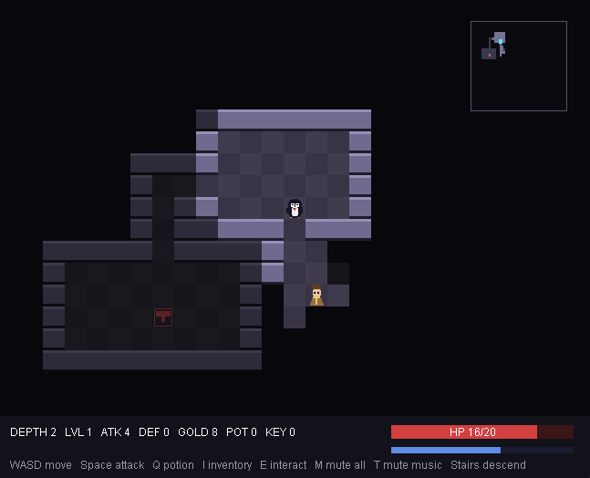
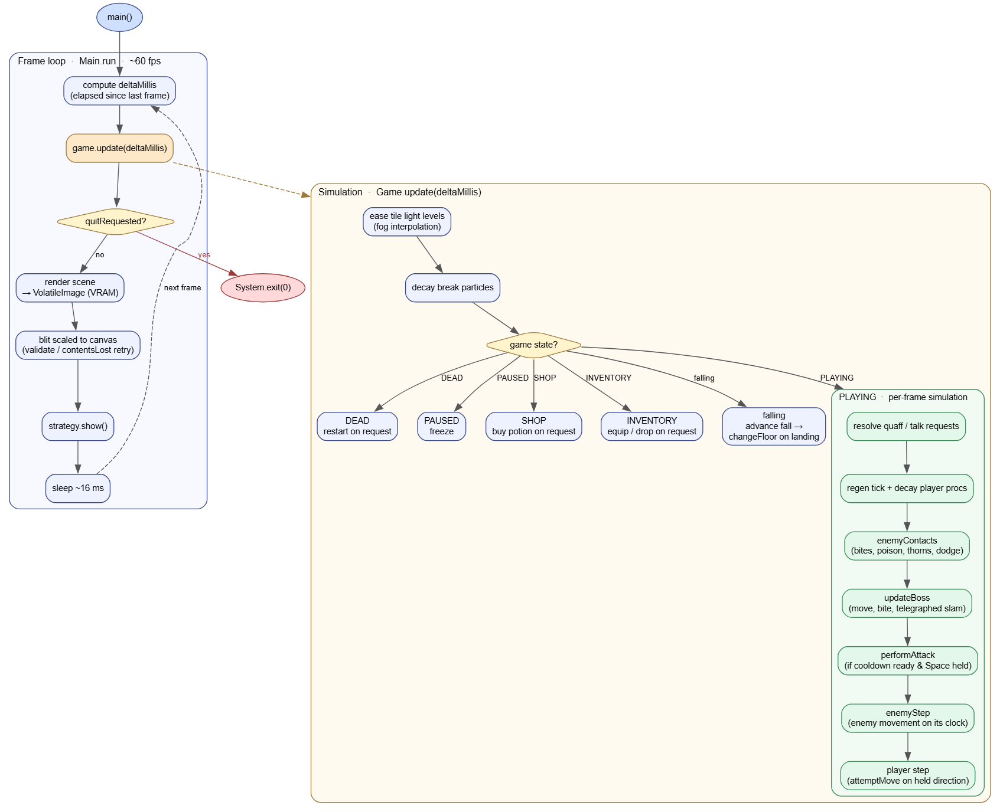
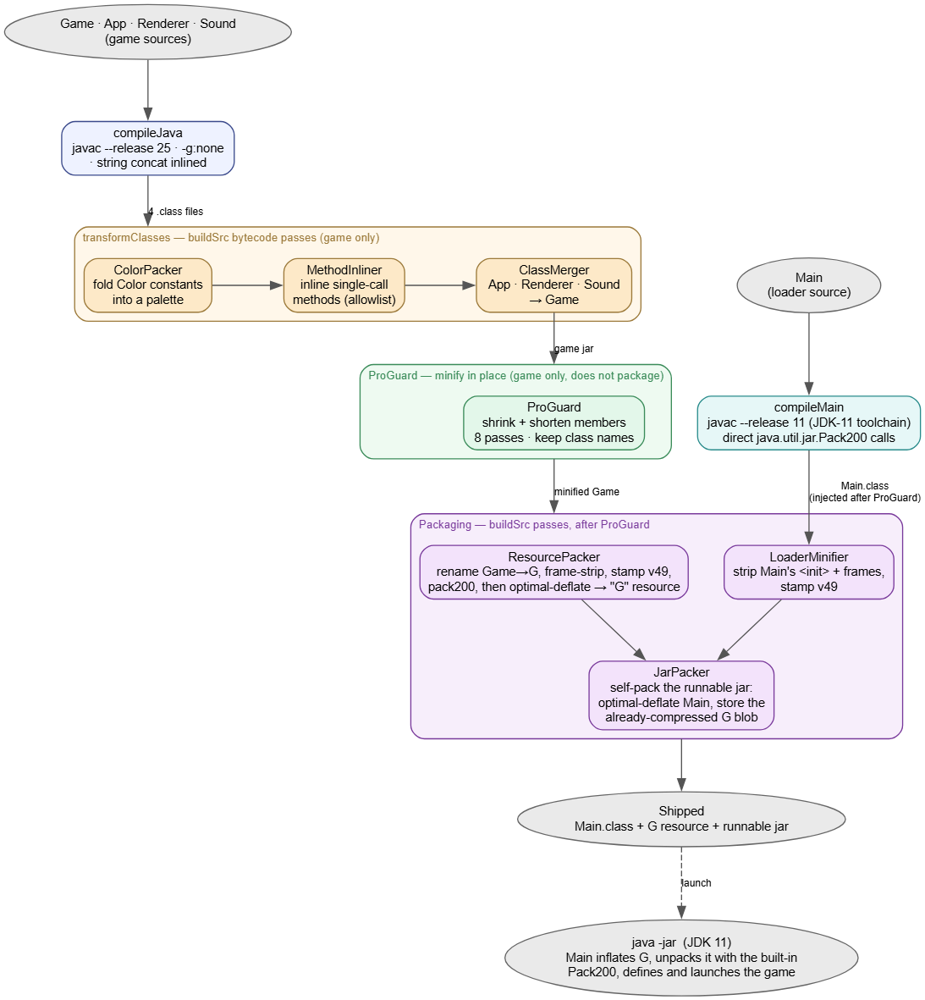

# Duke's Descent

A procedural dungeon crawler starring Duke, the Java mascot, built for the 8-bit
challenge. Descend through randomly generated floors, fight Java-themed enemies,
loot effect-bearing gear of escalating rarity, crack open sealed vaults, dodge
mimic chests, topple floor bosses, and see how deep you can get before you fall.



## Branches

- [`no-rules`](https://github.com/Tonic-Box/Dukes-8-Bit-Challenge/tree/no-rules) — The minified rules out the window version of the game
- [`auto`](https://github.com/Tonic-Box/Dukes-8-Bit-Challenge/tree/auto) — Check this out last~

## Build & Run

Requires **JDK 25** (Works best on Amazon Corretto).

```
./gradlew run     # play
./gradlew size    # print the measured compiled sizes
./gradlew build   # compile + package
```

## Notes for game-play
- It's to your benefit to try and fully explore each floor before going down:
  - You'll find gear to equip
  - Level up and get gold from killing stuff
  - Every floor has a shop npc you can buy potions from
- If you find a key, there is a locked room somewhere on your floor
- Buy all the potions you can (It's the only thing gold is used for)
- Every 5 floors is a boss

## Controls

| Action | Key |
| --- | --- |
| Move | WASD |
| Attack (also smashes breakable scenery) | Space |
| Interact - open shop, buy potion, open adjacent chest, equip selected item, confirm menu | E |
| Cancel - drink potion (in world), leave shop, close inventory | Q |
| Open inventory | Tab |
| Drop selected item (in inventory) | D |
| Navigate menus | W / S |
| Open a sealed vault door | Walk into it holding a key |
| Descend / ascend | Walk onto the gold / red stairs |
| Mute / unmute all audio | M |
| Mute / unmute music only | T |
| Pause / back out | Esc |

## Gameplay

- **Goal:** descend as far as possible. Score is the deepest floor reached.
- **Fog of war:** only tiles in line of sight are visible; explored tiles stay dimly remembered and a minimap in the top corner tracks the layout, stairs, vault doors, and enemies you have uncovered.
- **Enemies:** (Bug, NullPointer, MemoryLeak, ForkBomb, Deadlock) wake only once they enter your light, then pursue in real time, pulsing as they strike. Numbers and stats scale gently with depth; a ForkBomb splits into Bugs on death and a Deadlock is a slow, heavy brute.
- **Gear, effects & rarity:** weapons, armor, and trinkets drop as loot and from chests. Beyond raw attack and defense they carry effects: lifesteal, crit, reach, poison, knockback, thorns, dodge, heal-on-kill, and trinket perks - that flash visibly when they proc. Every drop also rolls a rarity - Common, Rare, or Legendary - that scales both its stats and its effect strength; higher rarities are scarce early and grow more common with depth (and bosses roll with boosted odds). The inventory screen shows your stats and the exact +/- of equipping each item.
- **Chests & mimics:** chests are opened with **E** when you stand beside them - but one in seven is a **mimic**, a demi-boss that springs to life and attacks. Mimics hit harder than the floor's regular enemies and are guaranteed to drop at least a Rare when slain.
- **Breakable scenery:** pots, crates, and vases sit in rooms and corridors, blocking the way until a sword swing smashes them. A broken prop occasionally coughs up loot.
- **Pits:** clusters of black pit tiles open in room interiors (never blocking a corridor). Step into one and Duke tumbles 1–3 floors down, taking fall damage and landing somewhere random - the floors he falls past are generated and remembered, so climbing back up stays consistent.
- **Keys & vaults:** sealed vault rooms, gated by a locked door, hide one to three chests. A key dropped elsewhere on the floor opens one, and vaults grow more common the deeper you go.
- **Bosses:** every fifth floor is an arena guarding the way down - a large multi-tile boss with a telegraphed area slam (its reach shown as highlighted danger tiles), an enrage at half health that summons minions, and a stairway that unseals only once it falls.
- **Progression:** kills grant XP and gold; leveling raises max HP and attack. HP also regenerates slowly while exploring.
- **Merchant:** a shopkeeper spawns on each floor and sells potions for gold.
- **Persistent floors:** a floor remembers itself - climb back up and your cleared enemies, opened doors, looted chests, smashed scenery, and felled bosses stay as you left them.
- **Audio:** procedural sound effects (slash, hit, footstep, stairs, key, chest break, mimic, pit fall, boss slam) and a looping chiptune track, all synthesized at runtime. Mute everything with **M** or just the music with **T**.

## Overview



## Architecture

Four single-responsibility game classes plus a bootstrap loader:

| Class | Responsibility |
| --- | --- |
| `App` | Window, render loop, keyboard input. |
| `Game` | All simulation: map generation, field of view, entities, combat, progression, state. |
| `Renderer` | All drawing; stateless, derived from `Game`. |
| `Sound` | Procedural audio: effects and a looping track on the JDK synthesizer. |
| `Main` | Bootstrap loader that unpacks and launches the game (see [Build-time passes](#build-time-bytecode-passes)). |

- **Data-oriented state:** flat primitive arrays (`int[] map`, parallel enemy arrays), no per-entity objects or allocation.
- **Real-time logic:** player, enemy, and attack actions run on independent millisecond clocks, interpolated each frame.
- **Procedural content:** rooms joined by corridors, per-tile ray-cast visibility, sprites from primitive shapes — no assets.
- **Procedural audio:** effects and music scheduled note-by-note onto the synthesizer (effects on channels 0–3, music on 4–6).
- **Seeded, persistent floors:** generated from `baseSeed + floor`, then snapshotted and restored on revisit.

## Algorithms & patterns

- **Floor generation:** rejection-sampled non-overlapping rooms (one-tile border), L-shaped corridor links; a per-floor seed rebuilds each floor identically.
- **Field of view:** Bresenham ray cast from the player to each tile in radius, stopping at walls/doors/scenery; visible tiles stay explored.
- **Vault isolation:** carved only where footprint, door, and border are solid rock, so the locked door is the only way in; the key spawns a fixed distance away.
- **Pit clusters:** grown by attaching open neighbors (up to four) that each pass a 3×3-floor interior test, so they never reach corridors.
- **Smooth motion:** a previous + current tile and a 0–1 progress, linearly blended each frame.
- **Lighting:** per-tile light eases toward visible/remembered; equal-darkness runs merge into one translucent overlay fill.
- **Entity storage:** structure-of-arrays with swap-remove for O(1) unordered deletion.
- **Floor persistence:** one depth-keyed `int[]` snapshot (header, fixed-stride entity/loot records, map + explored masks); first visits generate from the seed.
- **Item encoding:** one `int` per item — template id in the low bits, rarity above; stats and effects scale by rarity.
- **Rarity rolls:** depth-weighted probability bands (Legendary from floor 7, both clamped); bosses add a flat Rare bonus.
- **Boss collision:** the 3×3 boss is an AABB; a move checks every destination tile, and the slam hits the bordering ring.
- **Display scaling:** a fixed-resolution buffer stretched to the window keeps world coordinates resolution-independent.

## Code design notes

- **Input as drained flags:** AWT key events only set held/request booleans; the loop reads and acts on them, keeping simulation single-threaded. Discrete actions use edge detection so a held key fires once, not with OS key-repeat.
- **Single-`int` game state:** `PLAYING`/`SHOP`/`PAUSED`/`DEAD` is one `int` switched on in update and render — a state machine with no extra classes or enums.
- **Integer-rounded camera:** follows Duke's sub-pixel position but rounds to whole pixels before drawing, so scrolling stays crisp.
- **Directional avatar:** four facing sprites; the right profile is the left mirrored by a transform, so only one side is hand-built.
- **Boss as separate state:** the floor boss lives in its own fields, keeping its multi-tile collision, slam, and enrage out of the lightweight enemy arrays.
- **VRAM scene buffer:** the scene draws into a `VolatileImage` for a GPU blit, using the standard validate/`contentsLost` retry and no per-frame pixel rasters.

## Optimization strategies

Size is the compiled `.class` files plus resources under `build/classes/java/main` and `build/resources/main`; the game ships as one compressed resource (see the breakdown below).

- **Debug info stripped** (`-g:none`): line-number, local-variable, and source-file tables removed; source stays fully readable.
- **No asset files:** graphics and audio are generated at runtime.
- **Packed data tables:** numeric tables (enemy/item stats, note sequences) and the name lists ship as printable-char strings expanded at load — far smaller than the `int[]`/`String[]` initialization bytecode.
- **Computed and merged data:** derived where possible (an item's slot from its id); near-duplicate colors share constants.
- **No per-frame allocation:** hoisted colors and palettes, shared scratch buffers, reused entity arrays.
- **Root package:** classes in the default package, to shrink constant-pool references.

### Build-time bytecode passes
Implemented with **YABR**, my own bytecode library (no ASM/Javassist), run over the compiled classes before packaging:
- Inline single-call methods from a tuned scan (`tools/tune-inline`).
- Pack constant `Color` fields into one decoded palette.
- Merge `App`, `Renderer`, and `Sound` into `Game` — four constant pools into one.
- Frame-strip the merged class and compress it into the `Game` resource (see the loader pattern).
- Collapse object-type names in private/static method descriptors to a one-char placeholder: the unverified loader matches calls by descriptor *shape* (arity and slot kinds), not by type names, so the names are dead weight. JDK calls, overrides, fields, and `invokedynamic` keep real descriptors, which the JVM resolves by exact match.
- Compress with a from-scratch DEFLATE encoder (Zopfli-style optimal parse + block splitting) that beats the stock library at the same format — the stock inflater still decodes it.
- Self-pack the runnable jar: each entry optimally deflated, the compressed `Game` blob stored verbatim.

**Loader pattern:** `Main` inflates the `Game` blob and defines it into the bootstrap class loader, which is trusted and runs no verification — the only thing that reads StackMapTable frames. So the build strips those frames before compressing; the blob stays an ordinary Java 25 class file, just frameless. Trading a small fixed loader for the frame bytes plus compression of everything else roughly halves the measured size.




### Size breakdown

From `./gradlew size` (compiled classes + resources):

| Artifact | Size |
| --- | ---: |
| `Main.class` (bootstrap loader) | 2,226 B |
| `Game` resource (the whole game, compressed) | 17,274 B |
| **Total (measured)** | **19,500 B (19.04 KB)** |
| Packaged `DukesDescent-1.0.jar` | 18,685 B (18.25 KB) |
